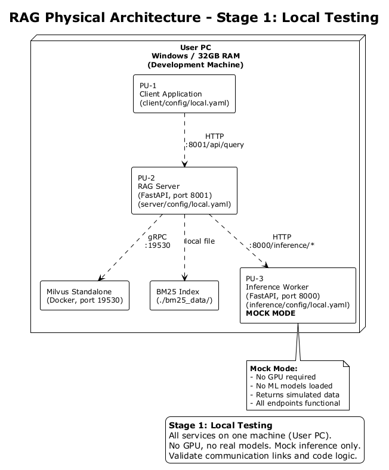
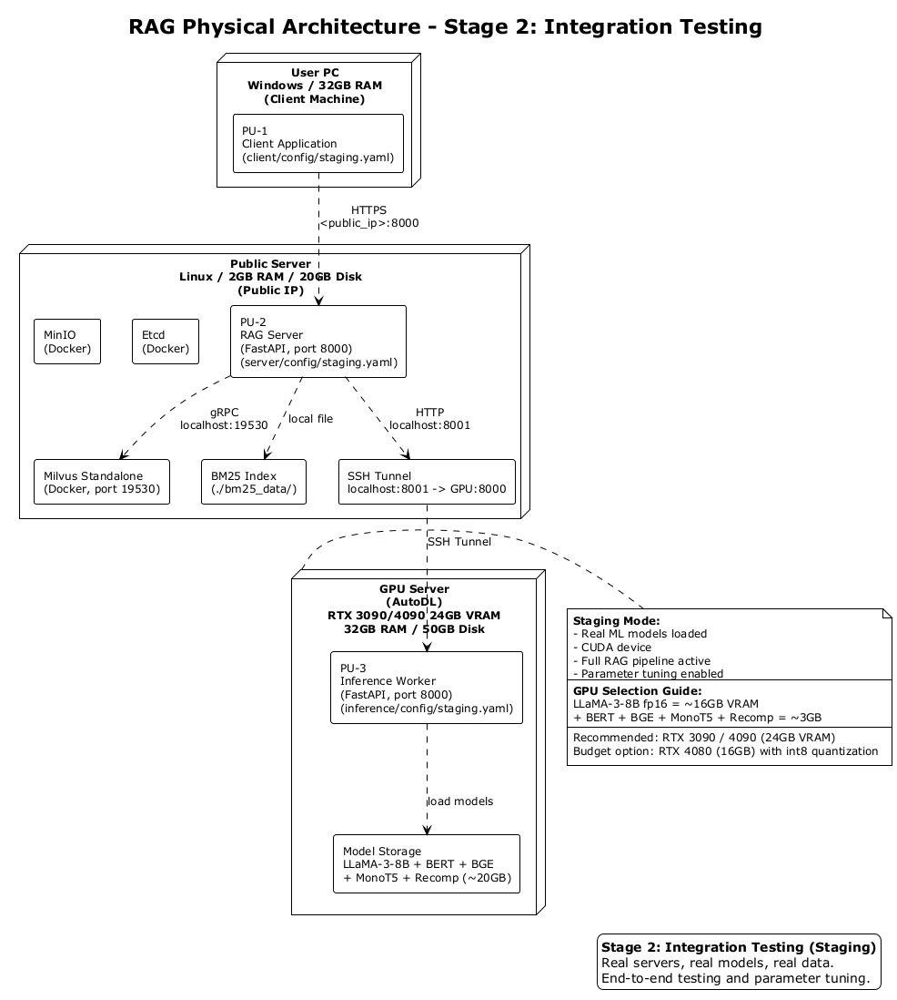
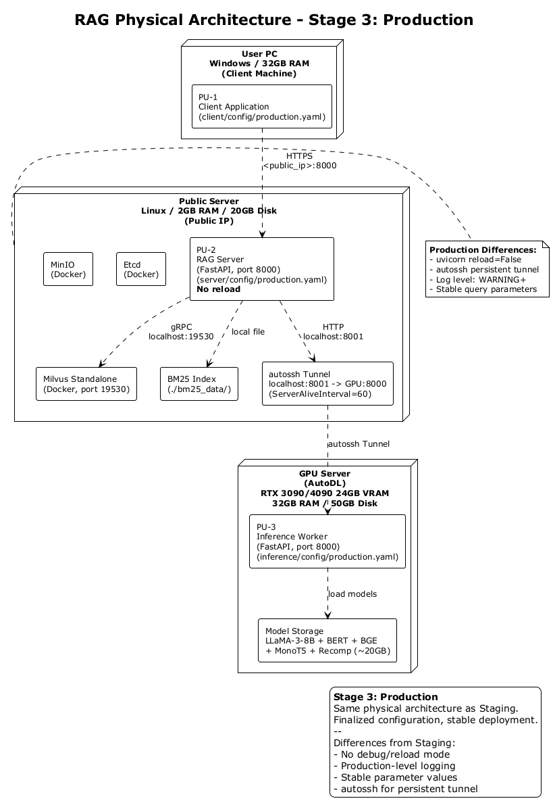

# RAG 部署指南

---

## 目录

- [配置参数汇总](#配置参数汇总)
- [阶段一：本地测试 (local)](#阶段一本地测试-local)
- [阶段二：联调联试 (staging)](#阶段二联调联试-staging)
- [阶段三：正式上线 (production)](#阶段三正式上线-production)

---

## 配置参数汇总

每个程序单元（PU）有独立的配置目录，包含三个版本的 YAML 配置文件。

### PU-1: Client 配置参数

| 参数 | local | staging | production | 说明 |
|------|-------|---------|------------|------|
| `client.server_url` | `http://127.0.0.1:8001` | `http://<public_server_ip>:8000` | `http://<public_server_ip>:8000` | RAG Server 地址 |
| `mode` | local | staging | production | 模式标识 |

配置文件位置：`client/config/local.yaml`、`client/config/staging.yaml`、`client/config/production.yaml`

### PU-2: RAG Server 配置参数

| 参数 | local | staging | production | 说明 |
|------|-------|---------|------------|------|
| `server.host` | `0.0.0.0` | `0.0.0.0` | `0.0.0.0` | 监听地址 |
| `server.port` | `8001` | `8000` | `8000` | 监听端口 |
| `server.milvus_host` | `localhost` | `localhost` | `localhost` | Milvus 地址 |
| `server.milvus_port` | `19530` | `19530` | `19530` | Milvus 端口 |
| `server.inference_url` | `http://localhost:8000` | `http://localhost:8001` | `http://localhost:8001` | Inference Worker 地址 |
| `server.collection_name` | `rag_collection` | `rag_collection` | `rag_collection` | Milvus 集合名 |
| `server.embedding_dim` | `768` | `768` | `768` | 向量维度 |
| `server.bm25_index_dir` | `./bm25_data` | `./bm25_data` | `./bm25_data` | BM25 索引目录 |

配置文件位置：`server/config/local.yaml`、`server/config/staging.yaml`、`server/config/production.yaml`

### PU-3: Inference Worker 配置参数

| 参数 | local | staging | production | 说明 |
|------|-------|---------|------------|------|
| `mode` | `mock` | `staging` | `production` | 运行模式 |
| `inference.host` | `0.0.0.0` | `0.0.0.0` | `0.0.0.0` | 监听地址 |
| `inference.port` | `8000` | `8000` | `8000` | 监听端口 |
| `inference.device` | `cpu` | `cuda` | `cuda` | 计算设备 |
| `inference.llm_model_path` | _(空)_ | `<remote_model_dir>` | `<remote_model_dir>` | LLM 模型路径 |
| `inference.classification_model` | `google-bert/bert-base-multilingual-cased` | 同左 | 同左 | 分类模型 |
| `inference.embedding_model` | `BAAI/bge-base-en-v1.5` | 同左 | 同左 | 嵌入模型 |
| `inference.monot5_model` | `castorini/monot5-base-msmarco-10k` | 同左 | 同左 | MonoT5 重排序 |
| `inference.bge_reranker_model` | `BAAI/bge-reranker-v2-m3` | 同左 | 同左 | BGE 重排序 |
| `inference.recomp_extractive_model` | `fangyuan/nq_extractive_compressor` | 同左 | 同左 | Recomp 抽取式 |
| `inference.recomp_abstractive_model` | `fangyuan/nq_abstractive_compressor` | 同左 | 同左 | Recomp 抽象式 |
| `inference.llmlingua_model` | `microsoft/llmlingua-2-bert-base-multilingual-cased-meetingbank` | 同左 | 同左 | LLMLingua 压缩 |

配置文件位置：`inference/config/local.yaml`、`inference/config/staging.yaml`、`inference/config/production.yaml`

---

## 阶段一：本地测试 (local)

### 目标

验证"文档索引 -> 向量存储 -> 检索查询"完整数据流的正确性。所有服务运行在一台机器上，Inference Worker 使用 mock 模式（随机向量/模拟数据），不加载任何 ML 模型，不需要 GPU。

### 物理架构



所有三个 PU（Client、RAG Server、Inference Worker）运行在同一台用户 PC 上。Inference Worker 使用 mock 模式，不加载真实模型。RAG Server 在端口 8001 上监听，Inference Worker 在端口 8000 上监听。

### 环境准备

```bash
cd D:\Source\RAG4\rag_deploy

pip install pyyaml
pip install -r server/requirements.txt
pip install -r client/requirements.txt
pip install fastapi uvicorn
```

> mock 模式不需要 torch、transformers 等重型依赖。

### 启动 Milvus

本地测试需要 Milvus 运行，用于存储向量索引和 BM25 数据。使用官方 Docker Compose 配置安装：

```bash
# 下载 Milvus 官方 docker-compose（国内镜像）
mkdir -p milvus && cd milvus
wget https://ghfast.top/https://github.com/milvus-io/milvus/releases/download/v2.5.27/milvus-standalone-docker-compose.yml -O docker-compose.yml
# 如果 ghfast.top 不可用，替换为以下任一镜像：
#   https://mirror.ghproxy.com/https://github.com/...
#   https://gh-proxy.com/https://github.com/...
#   或直接在浏览器下载后 scp 上传

# Docker 镜像加速（国内服务器必须配置）
sudo tee /etc/docker/daemon.json <<EOF
{
  "registry-mirrors": [
    "https://docker.1ms.run",
    "https://docker.xuanyuan.me"
  ]
}
EOF
sudo systemctl restart docker

# 启动 Milvus
sudo docker compose up -d
# 等待约 90 秒，确认三个容器均为 healthy
sudo docker compose ps
```

### 启动服务

终端 1 — Inference Worker (mock)：
```bash
python -m inference.main --mode local
```

终端 2 — RAG Server：
```bash
python -m server.main --mode local
```

### 运行全链路测试

终端 3 — 执行自动化测试脚本：

```bash
python tests/test_local.py
```

测试脚本会自动执行以下步骤：

1. **健康检查** — 验证 Inference Worker（mock 模式）和 RAG Server 在线
2. **Inference 端点测试** — 逐个验证 classify、embed、hyde、rerank、compress、generate 六个端点
3. **索引测试** — 上传 `tests/local_test_data/` 中的测试文档，验证文档切块 -> embed -> 写入 Milvus -> 构建 BM25 索引
4. **查询测试** — 发起三条查询，验证 Milvus 检索 + BM25 检索 + hybrid fusion + 全链路返回结果
5. **清理** — 删除测试用的 collection 和 BM25 索引文件

### 手动测试（可选）

如需手动逐步验证：

```bash
# 索引测试文档
python -m client.client --mode local index tests/local_test_data/

# 查询
python -m client.client --mode local query "What is RAG?"
```

### 验证清单

- [ ] `curl http://localhost:8000/health` 返回 `{"status":"ok","mode":"mock"}`
- [ ] `curl http://localhost:8001/health` 返回 `{"status":"ok"}`
- [ ] `python tests/test_local.py` 全部 PASS
- [ ] 日志中无报错

全部通过后进入阶段二。

---

## 阶段二：联调联试 (staging)

### 目标

将三个 PU 部署到真实服务器上，加载真实 ML 模型，使用真实数据进行端到端测试，调整检索参数直到效果满意。

### 物理架构



三个 PU 分布在三台机器上：
- **用户 PC**：运行 Client，通过公网 IP 连接 RAG Server
- **公网服务器**：运行 RAG Server + Milvus（Docker）+ BM25，通过 SSH 隧道连接 GPU 服务器
- **GPU 服务器（AutoDL）**：运行 Inference Worker，加载全部 ML 模型

### 2.1 GPU 服务器准备

```bash
# 连接
ssh -p <gpu_ssh_port> root@<gpu_ssh_host>

# 拉取代码
git clone https://github.com/24-Fahed/RAG-.git <remote_project_dir>
cd <remote_project_dir>
# 如目录已存在，则执行：
# git pull

# 安装依赖
pip install -r inference/requirements.txt

# 下载 LLM 模型（约 16GB）
curl -LsSf https://hugging-face.cn/cli/install.sh | bash
export HF_ENDPOINT=https://hf-mirror.com
hf download FudanDNN-NLP/llama3-8b-instruct-ragga-disturb \
    --local-dir <remote_model_dir>

# 启动
bash scripts/start_inference.sh staging
```

验证：`curl http://localhost:8000/health` 返回 `{"status":"ok","mode":"staging"}`

### 2.2 公网服务器准备

```bash
# 拉取代码
git clone https://github.com/24-Fahed/RAG-.git <remote_project_dir>
cd <remote_project_dir>
# 如目录已存在，则执行：
# git pull

# 安装 Docker
curl -fsSL https://get.docker.com | sh
systemctl start docker && systemctl enable docker

# Docker 镜像加速（国内服务器必须配置）
sudo tee /etc/docker/daemon.json <<EOF
{
  "registry-mirrors": [
    "https://docker.1ms.run",
    "https://docker.xuanyuan.me"
  ]
}
EOF
sudo systemctl restart docker

# 安装 Milvus Standalone（官方方式 + 国内加速下载）
mkdir -p <remote_milvus_dir> && cd <remote_milvus_dir>
wget https://ghfast.top/https://github.com/milvus-io/milvus/releases/download/v2.5.27/milvus-standalone-docker-compose.yml -O docker-compose.yml
sudo docker compose up -d
# 等待约 90 秒，确认三个容器均为 healthy
sudo docker compose ps

# 安装 Python 依赖
pip install -r server/requirements.txt

# 建立 SSH 隧道（保持此终端不关闭）
bash scripts/start_tunnel.sh
# 验证隧道：curl http://localhost:8001/health

# 代理问题（如果服务器配了代理）
export NO_PROXY=localhost,127.0.0.1

# 启动 RAG Server
bash scripts/start_server.sh staging
```

验证：`curl http://localhost:8000/health` 返回 `{"status":"ok"}`

### 2.3 运行全链路测试

在用户 PC 执行自动化测试脚本，脚本会自动拉取 SciFact 数据集、建立索引、执行查询并验证结果：

```bash
python tests/test_staging.py
# 或指定 server 地址
python tests/test_staging.py --server-url http://<public_server_ip>:8000
```

测试脚本执行流程：
1. 健康检查 — 验证 RAG Server 和 Inference Worker 通路
2. 拉取 SciFact — 从 HuggingFace 下载 BeIR/scifact（corpus + queries + qrels）
3. 索引 — 取前 1000 篇文档，切块 -> GPU 生成向量 -> 存入 Milvus -> 构建 BM25
4. 查询 — 取 10 条测试查询，验证检索文档数、答案质量、与 qrels 标注的相关文档命中情况
5. 输出查询统计：平均检索文档数、真实答案数、命中相关文档数

### 2.4 手动测试（可选）

如需手动验证或使用自己的数据：

```bash
# 索引自己的文档
python -m client.client --mode staging index /path/to/documents/

# 单次查询
python -m client.client --mode staging query "What is RAG?"

# 交互式查询
python -m client.client --mode staging query --interactive
```

### 2.5 参数调优

以下参数可在查询请求中调整，无需重启服务：

| 参数 | 默认值 | 说明 |
|------|--------|------|
| `search_method` | `hyde_with_hybrid` | 检索策略。可选：`hyde_with_hybrid`, `hybrid`, `hyde`, `bm25`, `original` |
| `rerank_model` | `monot5` | 重排序模型。可选：`monot5`, `bge` |
| `top_k` | `10` | 最终返回的文档数量 |
| `hybrid_alpha` | `0.3` | 稀疏检索权重。公式：`alpha * BM25 + (1-alpha) * Milvus`。值越大 BM25 权重越高 |
| `compression_ratio` | `0.6` | 上下文压缩比。值越小压缩越狠，但可能丢失关键信息 |
| `search_k` | `100` | 初始候选集大小。从 Milvus/BM25 各取多少条用于融合 |

建议顺序：
1. 先用小数据集确认全链路通
2. 调 `hybrid_alpha`（0.1~0.5）观察召回效果
3. 调 `compression_ratio`（0.4~0.8）观察生成质量
4. 对比 `monot5` 和 `bge` 重排序效果

### 2.6 验证清单

- [ ] GPU 服务器：Inference Worker 启动，`/health` 返回 staging
- [ ] 公网服务器：Milvus 运行，`sudo docker compose ps` 三个容器 healthy
- [ ] 公网服务器：SSH 隧道建立，`curl localhost:8001/health` 通
- [ ] 公网服务器：RAG Server 启动，`/health` 返回 ok
- [ ] `python tests/test_staging.py` 全部 PASS
- [ ] 查询返回真实答案（非 `[MOCK]` 前缀）
- [ ] 日志无报错

全部通过后进入阶段三。

---

## 阶段三：正式上线 (production)

### 目标

在联调联试通过的基础上，使用最终确定的配置正式运行。与 staging 物理架构完全相同，仅配置文件不同。

### 物理架构



与 staging 架构完全相同（同一组服务器）。主要差异：
- RAG Server 关闭 uvicorn reload
- SSH 隧道使用 autossh 保持持久连接
- 日志级别提升至 WARNING

### 操作步骤

```bash
# GPU 服务器
bash scripts/start_inference.sh production

# 公网服务器
bash scripts/start_tunnel.sh          # SSH 隧道（使用 autossh）
bash scripts/start_server.sh production

# 用户 PC
python -m client.client --mode production query "What is RAG?"
```

### 验证清单

- [ ] 返回真实生成的答案（非 `[MOCK]` 前缀）
- [ ] 重复查询结果稳定
- [ ] 各服务日志无错误
- [ ] autossh 隧道断线后自动重连
- [ ] 端口和地址使用生产配置值

### 停止服务

```bash
bash scripts/stop_all.sh
```
> 文档导航：
> [项目总览](README.md) | [文档导航](docs/README.md) | [架构图目录](docs/architecture/README.md)
