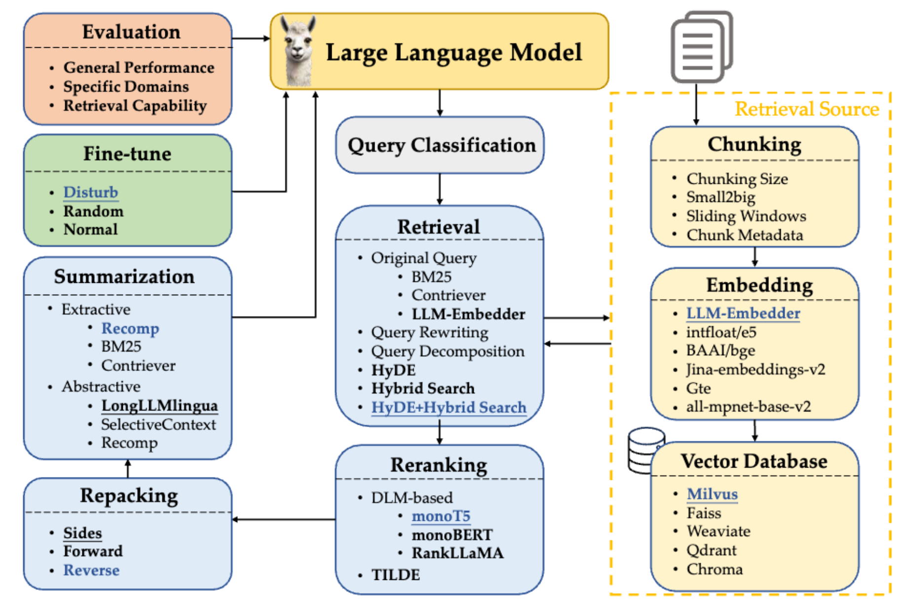

# RAG Deploy

## 项目简介

本项目实现了一条面向部署的 RAG 知识库链路，用于完成文档入库、检索、重排序、重打包与上下文压缩，并为上层系统提供可消费的检索结果与上下文。

本项目不负责最终回答生成。若需要生成最终回答，需要额外接入语言模型，并基于知识库输出继续处理。

## 论文与来源

本项目参考并实现了论文：

<a href="https://arxiv.org/pdf/2407.01219">Searching for Best Practices in Retrieval-Augmented Generation</a>

其中，`rag_langgraph/` 基于 LangGraph 对上游项目进行了工程化改写：

<a href="https://github.com/FudanDNN-NLP/RAG.git">https://github.com/FudanDNN-NLP/RAG.git</a>

## Workflow



当前主流程为：

`query -> hyde -> retrieve -> rerank -> repack -> compress`

## 目录结构

- `client/`
  - 命令行客户端
  - 用于发起建库和查询请求
- `server/`
  - 知识库服务入口
  - 负责索引、检索、融合、重排、重打包与流程编排
- `inference/`
  - 推理服务
  - 负责 `hyde / embed / rerank / compress`
- `rag_langgraph/`
  - 检索、重排、压缩、重打包等核心实现
- `docs/`
  - 项目文档、架构图与版本记录

## 快速开始

完整测试上线路径参考文件：[部署指南](DEPLOY_GUIDE.md)。

### 1. 启动 Inference Worker

```bash
python -m inference.main --mode local
```

### 2. 启动 RAG Server

```bash
python -m server.main --mode local
```

### 3. 查询知识库

```bash
python -m client.client --mode local query "What is RAG?"
```

### 4. 导入文档

```bash
python -m client.client --mode local index ./documents
```

## 文档入口

- [文档导航](docs/README.md)
- [客户端说明](client/README.md)
- [服务端说明](server/README.md)
- [推理服务说明](inference/README.md)
- [部署指南](DEPLOY_GUIDE.md)
- [架构图目录](docs/architecture/README.md)
- [v0.1.0 记录](docs/v0.1.0/README.md)
