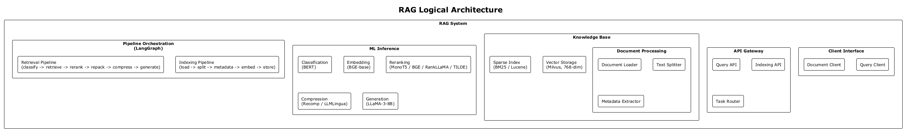
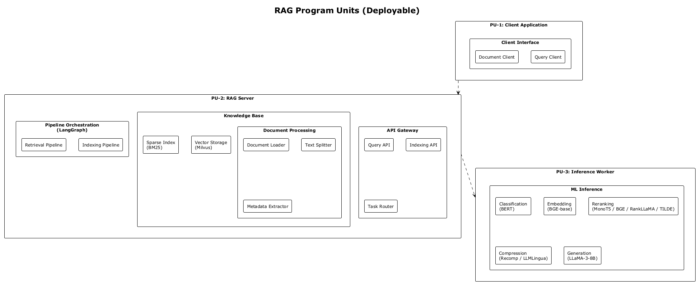
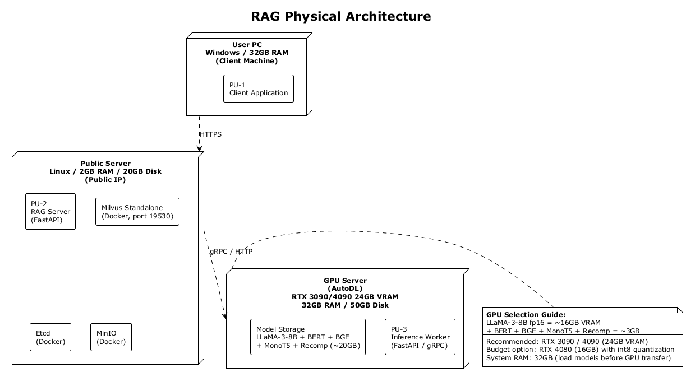

# 架构图目录

本目录存放架构图的 PlantUML 源文件与导出图片。

## 文件组织

- `05_logical_architecture.puml`
- `06_program_units.puml`
- `07_physical_architecture.puml`
- `08_physical_architecture_local.puml`
- `09_physical_architecture_staging.puml`
- `10_physical_architecture_production.puml`

## 图片预览

### Logical Architecture

### Program Units

### Physical Architecture

### Physical Architecture Local

### Physical Architecture Staging

### Physical Architecture Production

